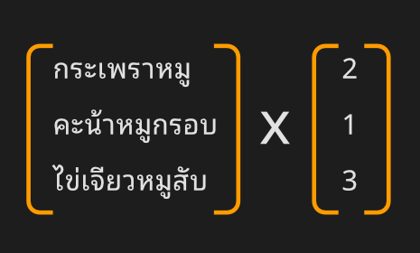

### 1.12 Math Vector

สวัสดีเพื่อนๆ ทุกคนครับ! 🙌 ในโลกของ 3D และ Geometry Nodes, Math Vector เป็นอีกหัวข้อที่เราควรรู้จักไว้ เพราะมันเป็นเครื่องมือพื้นฐานที่มีพลังมหาศาลในการบอก **ทิศทาง** และ **ขนาด** รวมถึงตำแหน่งต่างๆ ในพื้นที่ 3 มิติ การทำความเข้าใจ Vector จะช่วยให้เราควบคุมและสร้างสรรค์ Geometry ได้อย่างที่ต้องการเลย

---

### 1.12.1 Vector คืออะไร? (ในมุมมองที่เข้าใจง่าย)

เรามาเริ่มจากแนวคิดที่คุ้นเคยกันก่อนนะครับ ลองนึกถึง **“ชุดของข้อมูล”** ที่จัดเรียงกันตามลำดับลำดับ เช่น:

-   `'หมา', 'แมว' , 'หนู'` → ชุดข้อมูลของสัตว์เลี้ยง
-   `กระเพราหมูสับ, คะน้าหมูกรอบ, ไข่เจียวหมูสับ` → รายชื่ออาหาร

ถ้าเราเอาข้อมูลหลายชิ้นมาใส่ไว้ในวงเล็บ `[ ]` หรือ `( )` แล้วมองว่ามันเป็น **"ชุดข้อมูลที่มีลำดับ"** เราอาจเรียกมันว่า "เวกเตอร์" แบบกว้างๆ ได้เหมือนกัน และที่น่าสนใจคือ เราสามารถนำมันไปดำเนินการทางคณิตศาสตร์ ได้อย่างมีความหมายตามตำแหน่งของข้อมูลในชุด

#### ตัวอย่างอนาล็อก: รายการสั่งซื้ออาหาร + จำนวน

ลองดูตัวอย่างนี้ : 

แม่ค้าร้านตามสั่งแถวบ้าน แม้ไม่ได้เรียน set matrix ก็ยังเข้าใจได้ทันทีว่าหมายถึง:

* **กระเพราหมู:**   2 ห่อ 
* **คะน้าหมูกรอบ:**   1 ห่อ 
* **ไข่เจียวหมูสับ:**   3 ห่อ 

โดยการ "เอา ชุดรายการอาหาร x จำนวนที่สั่ง" เราอาจเรียกได้ว่า นี่เป็นการคูณกันของ 2 เวคเตอร์ 

**สิ่งสำคัญที่เราเห็นจากตัวอย่างนี้คือ "ลำดับ" มีความสำคัญมาก!** ตำแหน่งของข้อมูลในชุดจะสัมพันธ์กัน การดำเนินการจะทำทีละตำแหน่งที่ตรงกัน เราเรียกตำแหน่งต่างๆ ตามลำดับนี้ว่า **index**

> ในโลก 3D ง่ายกว่านี้มาก เพราะมีแค่ x,y,z สามตัวนี้เท่านั้น  ( อ้อ จริงๆ มี u,v,w อีกตัว )

---

### 1.12.2 เวกเตอร์ของตัวเลข (Vector in Math and 3D)

ในทางคณิตศาสตร์และกราฟิก 3D ที่เราจะใช้ใน Blender:

**เวกเตอร์ = ชุดข้อมูลตัวเลขที่มีลำดับ** ที่ใช้บอก **ขนาด (Magnitude)** และ **ทิศทาง (Direction)** จากจุดอ้างอิงใดๆ และสามารถนำมาดำเนินการทางคณิตศาสตร์ ได้อย่างมีความหมายตามตำแหน่ง (index)

เวกเตอร์สามารถมีได้หลายมิติ ขึ้นอยู่กับจำนวนตัวเลขในชุด:

* **1 มิติ:** `[x]` เช่น `[25]` บอกขนาด 25 ในทิศทางบวก หรือ `[-10]` บอกขนาด 10 ในทิศทางลบ (ถ้าเริ่มจาก 0)
    * *ตัวอย่างการคำนวณเวกเตอร์ 1 มิติ (อนาล็อกเงิน):*
        * A ได้เงินมา 20 บาท → เวกเตอร์ A = `[20]` (ทิศทางบวก)
        * B ใช้เงินไป 10 บาท → เวกเตอร์ B = `[-10]` (ทิศทางลบ)
        * จงหาเวกเตอร์ C = การเปลี่ยนแปลงของเงินรวม
        * C = A + B
        * C = `[20]` + `[-10]`
        * C = `[10]`
        * สรุป: เวกเตอร์ C คือ `[10]` หมายถึง การเปลี่ยนแปลงรวมคือ +10 บาท ในทิศทางบวก (เงินเหลือ 10 บาท ทิศทางยังเป็น + เทียบกับ 0 บาท)

* **2 มิติ:** `[x, y]` ใช้บอกตำแหน่งหรือทิศทางบนระนาบ 2 มิติ เช่น `[0, 5]`, `[5.1, 25.5]`
* **3 มิติ:** `[x, y, z]` ใช้บอกตำแหน่งหรือทิศทางในพื้นที่ 3 มิติ เช่น `[0, 1, 3]`, `[12, 25, 91]`

ถ้าเวกเตอร์นั้นเรายังไม่ได้เอาไปดำเนินการบวก/ลบกับเวกเตอร์อื่น ให้เราคิดว่ามันคือ **Vector ที่บอกตำแหน่ง** หรือ **Vector ที่บอกทิศทาง** โดยมีจุดเริ่มต้นอยู่ที่จุดกำเนิด (Origin) `[0, 0, 0]` ของ Space นั้นๆ

      เรื่องลำดับ ยังคงสำคัญเสมอ เราไม่สามารถ (+-x/) ข้ามตำแหน่งไม่ได้ [x1,y1,z1] x [x2,y2,z2] 

       - x ต้องทำกับ x

       - y ต้องทำกับ y

       - z ต้องทำกับ z เท่านั้น 
      
       - เช่น ถ้าเราเอา คะน้าหมูกรอบ ไป x 3 จะผิดทันที เพราะสั่งแค่ 1 ห่อ แต่ดันทำ 3 ห่อ

---

### 1.12.3 โลก 3 มิติและ Vector [x, y, z]

ในโลก 3 มิติของ Blender เราใช้เวกเตอร์ 3 มิติ `[x, y, z]` เป็นหลักเพื่อระบุ **ตำแหน่ง** ของจุด Vertex, ตำแหน่งของ Object หรือบอก **ทิศทาง** ต่างๆ

* `x` → บอกตำแหน่ง/ทิศทาง ในแนวแกน X (ปกติคือแนวนอน ซ้าย-ขวา)
* `y` → บอกตำแหน่ง/ทิศทาง ในแนวแกน Y (ปกติคือแนวลึก หน้า-หลัง)
* `z` → บอกตำแหน่ง/ทิศทาง ในแนวแกน Z (ปกติคือแนวตั้ง ขึ้น-ลง)

> เช่น เวกเตอร์ `[1, 2, 3]` ถ้ามองเป็นตำแหน่ง หมายถึงจุดที่อยู่ห่างจากจุดศูนย์กลาง `[0, 0, 0]` ไปทางแกน +X 1 หน่วย, ทางแกน +Y 2 หน่วย และทางแกน +Z 3 หน่วย

> **เกร็ดเล็กน้อย:** แกน Z ที่ชี้ขึ้นเป็นค่า Default ของ Blender แต่บางโปรแกรม 3D อื่นๆ อาจใช้แกน Y ชี้ขึ้นแทน เช่นใน three.js อันนี้เป็นข้อควรรู้เวลาทำงานข้ามโปรแกรมครับ

> **ถ้าเห็นคำว่า [u, v, w] เป็นเวคเตอร์ ที่ใช้ใน texture space เดี๋ยวเจอในเรื่อง shader**

---

### 1.12.4 การดำเนินการพื้นฐานของ Vector (Basic Vector Operations in 3D)

การดำเนินการทางคณิตศาสตร์กับ Vector 3 มิติ ก็มีหลักการคล้ายกับตัวอย่าง 1 มิติที่เราเห็น **เพียงแต่เราจะดำเนินการกับค่า X, Y, Z ของแต่ละเวกเตอร์แยกกัน**:

* **การบวก Vector (Vector Addition):**
    * ผลลัพธ์คือ Vector ใหม่ที่ได้จากการเอาค่า X, Y, Z ของสองเวกเตอร์มาบวกกันตามตำแหน่ง
    * `[A.x, A.y, A.z] + [B.x, B.y, B.z] = [A.x + B.x, A.y + B.y, A.z + B.z]`
    * ในเชิงแนวคิด คือการรวม "การเคลื่อนที่" หรือ "ทิศทาง" ของสองเวกเตอร์เข้าด้วยกัน

* **การลบ Vector (Vector Subtraction):**
    * ผลลัพธ์คือ Vector ใหม่ที่ได้จากการเอาค่า X, Y, Z ของสองเวกเตอร์มาลบกันตามตำแหน่ง
    * `[A.x, A.y, A.z] - [B.x, B.y, B.z] = [A.x - B.x, A.y - B.y, A.z - B.z]`
    * การลบที่สำคัญคือการหา **ทิศทาง จากจุดหนึ่งไปยังอีกจุดหนึ่ง**: ท่องง่ายๆ ว่า ทิศทางจาก A ไป B คือ เวคเตอร์ B - เวคเตอร์ A

* **การคูณ/หารด้วย Scalar (Scalar Multiplication/Division):**
    * คือการเอาตัวเลขเดี่ยวๆ (Scalar) ไปคูณหรือหาร Vector ทั้ง Vector
    * ผลลัพธ์คือ Vector ใหม่ที่ทิศทางยังคงเดิม แต่ **ขนาด (Magnitude)** เปลี่ยนไป
    * `[A.x, A.y, A.z] * s = [A.x * s, A.y * s, A.z * s]`
    * `[A.x, A.y, A.z] / s = [A.x / s, A.y / s, A.z / s]`
    * ใช้ในการย่อ/ขยาย Vector หรือเปลี่ยนขนาดของ Effect โดยไม่เปลี่ยนทิศทาง

---

### 1.12.5 คุณสมบัติและการแปลงค่า Vector ที่สำคัญ

* **ขนาดของ Vector (Magnitude หรือ Length):**
    * คือ ความยาวของ Vector หรือระยะห่างจากจุดเริ่มต้น `[0,0,0]` ไปยังปลาย Vector
    * คำนวณจากสูตรคล้ายพีทาโกรัสใน 3D: $\sqrt{x^2 + y^2 + z^2}$
    * ใช้ในการหาระยะห่างทั้งหมด, เปรียบเทียบขนาด หรือควบคุม Effect ที่ขึ้นอยู่กับระยะทาง
    * **ระยะห่างระหว่างจุด (Distance Between Points):** ขนาดของ Vector ที่ได้จากการลบกันระหว่างจุด 2 จุด (คือ `Length(B - A)`)

* **Vector หน่วย (Unit Vector หรือ Normalized Vector):**
    * คือ Vector ที่มี **ขนาด (Magnitude)** เท่ากับ **1** เสมอ
    * มีความสำคัญมาก เพราะมันใช้บอก **ทิศทาง** เพียงอย่างเดียว โดยไม่มีผลกับขนาดใดๆ (เพราะขนาดเป็น 1)
    * ตัวอย่างที่พบบ่อยที่สุดคือ **Normal Vector** ที่บอกทิศทางตั้งฉากของพื้นผิว

* **การทำ Vector ให้เป็น vector หน่วย (Normalization):**
    * คือ กระบวนการแปลง Vector ใดๆ ให้กลายเป็น Unit Vector โดยที่ทิศทางยังคงเดิม
    * ทำได้โดยเอา Vector ต้นฉบับ **หารด้วย ขนาด (Length)** ของตัวมันเอง
    * ใช้เมื่อเราต้องการแค่ "ทิศทาง" จาก Vector หนึ่ง โดยไม่สนใจขนาดดั้งเดิม

---

### 1.12.6 การสร้างและใช้งาน Vector ใน Geometry Nodes

ใน Blender Geometry Nodes เรามี Nodes หลายตัวที่ให้ค่าเป็น Vector หรือใช้ Vector ในการคำนวณ:

* **Input Nodes บางตัว:** เช่น `Position` (ให้ Vector ตำแหน่งของแต่ละจุด), `Normal` (ให้ Unit Vector ทิศทางตั้งฉากของพื้นผิว), `Tangent` (ให้ Unit Vector ทิศทางของ Curve)
* **Constant Vector:** สามารถพิมพ์ค่า `[x,y,z]` ลงไปใน Node ที่รับค่า Vector ได้โดยตรง (ปกติเป็น Socket สีม่วง)

**การสร้าง Vector จากค่าแกน (Combine XYZ Node):**

Node `Input > Combine XYZ` ใช้สร้าง Vector 3 มิติ `[x, y, z]` จากค่า Scalar (ตัวเลขเดี่ยวๆ) ของแต่ละแกนที่เราป้อนเข้าไป:

-   X → กำหนดค่าในแนวแกน X
-   Y → กำหนดค่าในแนวแกน Y
-   Z → กำหนดค่าในแนวแกน Z

*Node `Combine XYZ` รับค่า Scalar สีเทา 3 ค่า แล้วรวมกันเป็น Vector สีม่วง 1 ค่า*

**ตัวอย่างการสร้างจุดง่ายๆ ด้วย Vector ตำแหน่ง:**

เราใช้แนวคิดว่า Position คือ Vector ตำแหน่งจากจุดกำเนิด มาสร้างจุดที่ต้องการได้

สร้าง จุด 1 จุด ที่ตำแหน่ง `[1, 2, 3]` ด้วย Node `Combine XYZ` และ `Set Position`:

*Node `Combine XYZ` สร้าง Vector `[1, 2, 3]` แล้วส่งให้ Node `Set Position` นำไปกำหนดเป็นตำแหน่งใหม่ของ Point ซึ่งเริ่มต้นที่ `[0,0,0]` ทำให้ Point ขยับไปอยู่ที่ตำแหน่ง `[1, 2, 3]`*

---

### 1.12.7 Nodes ที่สำคัญสำหรับการคำนวณ Vector

Node ที่เป็นหัวใจหลักสำหรับการดำเนินการทางคณิตศาสตร์กับ Vector คือ **Vector Math Node**:

 
> function ทั้งหมดของ vector math

Node นี้สามารถเลือกโหมดการทำงานได้หลากหลายมาก ครอบคลุมการดำเนินการพื้นฐานที่เราพูดถึงและอื่นๆ อีกมากมาย เช่น:

* **Add, Subtract, Multiply, Divide:** การบวก ลบ คูณ หาร Vector (หรือ Vector กับ Scalar)
* **Dot Product:** ผลลัพธ์เป็น Scalar บอกว่า Vector สองอันชี้ไปในทิศทางเดียวกันมากแค่ไหน (-1 ถึง 1) 
* **Cross Product:** ผลลัพธ์เป็น Vector ใหม่ที่ตั้งฉากกับ Vector สองอันเดิม (ใช้หา Normal หรือ Axis การหมุน)
* **Normalize:** ทำให้ Vector ที่ป้อนเข้าไปกลายเป็น Unit Vector
* **Length:** คำนวณหาขนาดของ Vector (distane of vector to origin)
* **Distance:** คำนวณหาระยะห่างระหว่างปลาย Vector สองอัน (distance of 2 vector)

Nodes อื่นๆ ที่เกี่ยวข้องและใช้งานบ่อย:

* **Separate XYZ:** แยก Vector `[x, y, z]` ออกเป็นค่า Scalar `x`, `y`, `z` เพื่อดึงแต่ละค่ามาใช้
* **Align Euler to Vector:** Node สำคัญมาก ใช้ปรับค่าการหมุน (Rotation ในรูป Euler Angle) ของ Object หรือ Instance ให้ชี้หรือจัดแนวตามทิศทางของ Vector ที่กำหนด 

---

> 68.05.10
