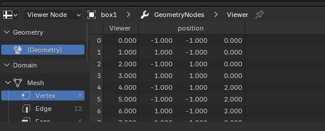

# 1.3 Components Overview

ใน Geometry Nodes ของ Blender ทุกสิ่งประกอบขึ้นจาก **Node Components** หรือ "คอมโพเนนต์" ซึ่งเป็นตัวต่อเล็ก ๆ ที่มีหน้าที่เฉพาะ  
โดยการเชื่อมต่อ node ต่าง ๆ เข้าด้วยกัน เราสามารถสร้างประกอบกันเป็นรูปทรง หรือ ระบบ animation ที่ซับซ้อนได้

ในหัวข้อนี้ เราจะแยกแยะประเภทของคอมโพเนนต์หลัก ๆ ที่ใช้งานบ่อยใน Geometry Nodes

---

ทุกครั้งหลังจากสร้าง Geometrynodes แล้วเห็น 2 nodes นี้เป็นค่าเริ่มต้นเสมอ

## 1.3.1 Input Nodes

ใช้สำหรับนำข้อมูลเข้าสู่ระบบ เช่น:

   - **Geometry**: นำ geometry จากต้นทางเข้ามาใช้งาน หรือ สร้างขึ้นมา
   <!-- - **Value / Vector / Boolean / Color**: ป้อนค่าคงที่ต่าง ๆ -->
   <!-- - **Object Info / Collection Info**: ดึงข้อมูลจากวัตถุอื่นใน scene -->

## 1.3.2 Output Nodes

ใช้สำหรับส่งผลลัพธ์ของ node graph กลับไปที่ modifier:

   - **Group Output**: จุดสิ้นสุดของ node group สำหรับส่งข้อมูลที่ได้ ออกไปสู่โปรแกรมหลัก
   - **Viewer (Blender 4.x)**: สำหรับดูผลลัพธ์ชั่วคราวระหว่างทำงาน > ข้อมูลจะแสดงที่ spread sheet หรือ ในหน้าจอ 3D เปิด Viewer Node > Attribute Text

---

## 1.3.3 Geometry Nodes

แกนหลักของการจัดการรูปทรง: 

   - **Mesh Primitives**: เช่น Cube, Ico Sphere, Cylinder
   - **Curve / Point / Volume Nodes**: สร้างหรือจัดการ curve, จุด, volume
   - **Transform / Join / Merge Geometry**: รวมและปรับแต่งรูปทรง

## 1.3.4 Attribute & Field Nodes

ใช้จัดการกับข้อมูลในแต่ละจุด เช่น:

   - **Position, Normal, Index**: ดึงข้อมูลจาก geometry
   - **Attribute Math / Combine / Separate**: คำนวณและจัดการข้อมูลใน field

## 1.3.5 Utility Nodes

ใช้สำหรับ logic และ control flow:

   - **Switch, Compare, Boolean Math**: ควบคุมเงื่อนไขและการทำงาน
   - **Map Range, Clamp, Noise Texture**: สร้างความเปลี่ยนแปลงหรือสุ่มค่า

## 1.3.6 Instance Nodes

ใช้สำหรับสร้างวัตถุซ้ำ ๆ:

   - **Instance on Points**
   - **Pick Instance**
   - **Realize Instances**

## 1.3.7 Group Nodes

- รวม node หลายตัวเป็นกลุ่มเดียว เพื่อความเป็นระเบียบและนำกลับมาใช้ซ้ำ
- รองรับ input/output ของตัวเองเหมือนฟังก์ชันในโปรแกรมมิ่ง

---

## สรุป

การเข้าใจภาพรวมของคอมโพเนนต์ใน Geometry Nodes จะช่วยให้สามารถวางระบบ node graph ได้อย่างมีโครงสร้าง  
ในบทถัดไป เราจะลงลึกไปที่การใช้งาน **Fields และ Attribute** ซึ่งเป็นหัวใจสำคัญของการควบคุมข้อมูลในระบบ node graph ของ Blender
