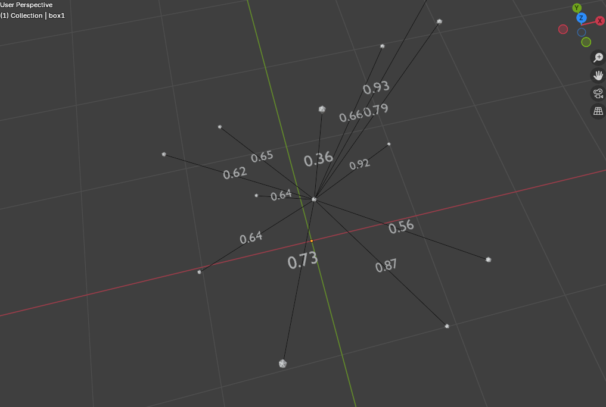
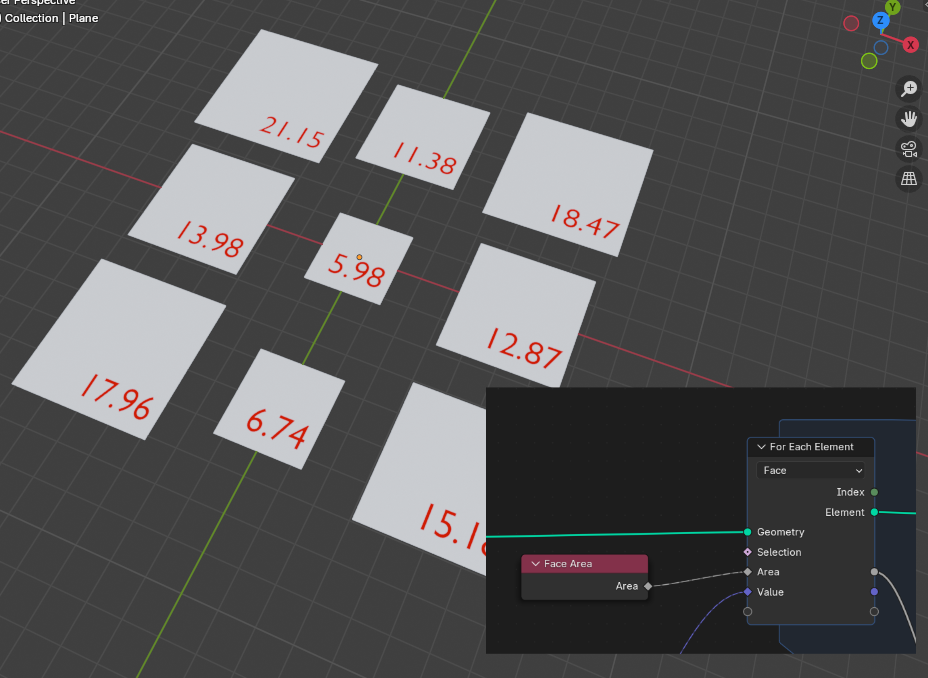

# 1.4 Fields and Attributes

ใน Geometry Nodes ระบบ “Field” และ “Attribute” เป็นหัวใจสำคัญที่ช่วยให้เราควบคุมค่าต่าง ๆ ในแต่ละจุดของ Geometry ได้อย่างยืดหยุ่นและมีประสิทธิภาพ

ทั้งสองอย่างนี้เกี่ยวข้องกับข้อมูลที่ไหลผ่าน node graph เพื่อควบคุมลักษณะของ geometry ในระดับจุด (point), เส้น (edge), ระนาบ/พื้นผิว (face)

---

### 1.4.1 Fields คืออะไร?

**Field** คือรูปแบบของข้อมูลที่สามารถวัดได้ เปลี่ยนแปลงได้ในแต่ละตำแหน่งบน geometry (จุด เส้น ระนาบ ...)

ตัวอย่างเช่น ค่าความสว่างบนพื้น ในห้องขนาด 5x5 เมตร ที่มีประตู 1 บาน ความสว่างของแต่ละจุดบนพื้นจะไม่เท่ากัน จุดที่อยู่ใกล้ จะสว่างมากกว่าจุดที่อยู่ไกลหน้าต่าง

เราจะเก็บข้อมูลนี้ได้ด้วยการ นำเซนเซอร์วัดความสว่างไปว่างที่จุดต่างๆ แล้วบันทึกไว้ (ในรูป ให้จุดสีแดง เป็นเครื่องวัด ความสว่าง ที่ตัววัดแต่ละตัวที่ตำแหน่งต่างๆ )

ในทาง 3D เราสร้าง grid ขนาด 5x5 แล้วเราจะเก็บค่าที่วัดได้ ไว้ในจุดนั้นๆ
ข้อมูลที่ได้ 5x5 = 25 ชุดข้อมูลนี้ เรียกว่า Field ของความสว่าง ที่วัดได้

Fields จะไหลผ่าน node graph เหมือน “เส้นทางคำนวณ” และถูกเรียกมาใช้งานภายหลังความความต้องการ เมื่อเรียกใช้

-   มีการทำงานแบบ lazy evaluation — ค่าจะถูกคำนวณเมื่อจำเป็นต้องใช้
-   เก็บข้อมูลที่ใด้ในรูปตัวแปร เรียกว่า Attribute แอททริบิวต์
-   ให้ผลลัพธ์ออกมาเป็นข้อมูล

จากจุดนี้ จะเห็นว่า เราสามารถ เก็บ หรือ สร้าง fields ข้อมูลใดๆ ก็ได้
เช่น

-   fields ของ ระยะทาง จุดต่างๆ ถึง ประตู
-   fields ของตำแหน่ง X,Y ของ censor แต่ละตัว
-   fields ของหมายเลขประจำตัวของ censor แต่ละตัว

> ภาพแสดง field ข้อมูลของความยาว ของเส้น edge length
>
> -   curve ใช้ spline parameter เป็นตัวเรียก ความยาวเส้น มาให้
> -   edge mesh ใช้ vector math position (A - B) = ระยะทางระหว่าง A ถึง B

> ภาพแสดง field ข้อมูลพื้นที่ของสี่เหลี่ยม ที่ Node face area ดึงข้อมูลมาแสดง

### 1.4.2 Attributes คืออะไร?

**Attribute** คือข้อมูลที่ผูกอยู่กับ geometry เช่นข้อมูลที่ระบุไว้กับจุด เส้น ระนาบ

จากตัวอย่างข้างต้น ค่าความสว่างที่จุดต่างๆ จุดที่อยู่ใกล้ประตู มีค่ามากกว่าจุดที่อยู่ไกล จุดต่างๆ จะมีค่าตามที่วัดได้ในแต่ละจุดที่เรากำหนดขึ้นมา ดังที่แสดงเป็นตัวเลข

-   ข้อมูลของ Geometry ที่สามารถถูกจัดเก็บไว้ในแต่ละระดับองค์ประกอบ (domain) ต่อ Vertex, Edge, Face ม ฯลฯ อยู่ที่เราเลือกว่าจะเก็บไว้แบบใหน เพื่อเอาไปทำอะไร
-   สามารถเรียกใช้ และ เข้าถึงได้ในรูปแบบของ Fields
-   จะถูกส่งผ่าน (propagated) ไปตามโหนด Geometry ต่างๆ
-   มีหลายประเภทหลักๆ คือ:
    -   **แบบ Dynamic:** คือตัวแปรทั่วไปของ blender (Global names) ที่มีให้ใช้งานอยู่เสมอ เช่น ตำแหน่ง (position), ดัชนีของ geometry (index), ดัชนีวัสดุ (material_index)
    -   **แบบ Static:** คือข้อมูลที่เราสร้างขึ้น หรือถูกสร้างขึ้นมา (Generated) เช่น ค่า UV, การเลือก (selection) , หรือ วิธีการคำนวณใดๆ ที่เรากำหนดขึั้น

### 1.4.3 การใช้ Field กับ Attribute ร่วมกัน

> Random value จะสร้าง field ชุดตัวเลขสุ่ม ในช่วงที่เรากำหนด min-max แล้วเอาค่า (attribute) ไปใช้ ย่อ-ขยาน ขนาดของ grid

ข้อมูลประเภท Field input จะเป็นรูป สี่เหลี่ยม (diamond)

-   **Position** field ของ position นำมา Scale กับ Index ผลที่ได้ >>
-   **Set Position** ใส่ค่า Posisition ใหม่ จากค่าที่ได้จากการคำนวณข้างต้น

### 1.4.4 Attribute Domains

ข้อมูลแบบ attribute สามารถถูกผูกกับ “domain” ต่าง ๆ เช่น:

-   **Point Domain** – สำหรับข้อมูลที่เปลี่ยนในแต่ละ vertex
-   **Edge Domain** – สำหรับขอบ (ไม่รองรับทุก node)
-   **Face/Corner Domain** – สำหรับหน้า polygon หรือมุม
-   **Spline/Curve Domain** – สำหรับ curve หรือเส้น

ทำให้เราสามารถทำงานที่ระดับต่างๆ ของ Geometry ได้อย่างง่าย ลบทั้งวัตถุ , face หรือ edge หรือจะเลือกเป็นจุดๆ ใดๆ ก็ได้จากการเลือก Domain

---

### 1.4.5 การสร้างและจัดเก็บ Attribute ที่กำหนดเอง (Custom Attributes and Storing Values)

บางครั้งเราต้องการสร้างข้อมูลขึ้นมาใน Node Tree (จาก Field ต่างๆ ที่เราคำนวณ) แล้วจัดเก็บข้อมูลนั้นไว้เป็น Attribute บน Geometry เพื่อนำไปใช้ในภายหลัง อาจจะในส่วนอื่นของ Node Tree เดียวกัน, ใน Shader Editor, หรือใน Modifier อื่นๆ ที่อยู่ต่อจาก Geometry Nodes นี้

เราใช้ Node ชื่อ **Store Named Attribute** ในการดำเนินการนี้

 
> สร้างตัวแปร (attribute) ชื่อ NewPosition เก็บค่า position Z+1 
> 
>   - Store Name Attribute : เก็บ
>   - Named Attribute : เรียกมาใช้
> 

องค์ประกอบหลักของ Node Store Named Attribute:

-   **Name:** กำหนดชื่อของ Attribute ที่ต้องการสร้าง หรือเขียนทับลงไป (ถ้าชื่อนั้นมีอยู่แล้ว) ชื่อนี้จะใช้ในการอ้างอิง Attribute นี้ในภายหลังได้จากส่วนอื่นของ blender (เช่น ใน Shader Editor หรือ driver)
-   **Data Type:** เลือกชนิดข้อมูลที่ต้องการเก็บ เช่น Float (เลขทศนิยม), Vector (ตำแหน่ง/ทิศทาง), Color (สี), Integer (เลขจำนวนเต็ม), Boolean (จริง/เท็จ) ต้องเลือกให้ตรงกับชนิดของข้อมูล Field ที่ป้อนเข้ามา
-   **Domain:** เลือกว่าจะจัดเก็บ Attribute นี้ไว้ที่ Domain ใด (Point, Edge, Face, Face Corner) ข้อมูล Field ที่ป้อนเข้ามาจะถูกประเมินค่าและจัดเก็บตาม Domain ที่เลือก
-   **Value (Field Input):** เชื่อมต่อ Field ที่คำนวณได้ (ข้อมูลที่ต้องการจัดเก็บ) เข้าที่นี่

เมื่อ Node นี้ทำงาน ข้อมูลจาก Field ที่ป้อนเข้ามา จะถูกประเมินค่าสำหรับแต่ละองค์ประกอบใน Domain ที่เลือก และจัดเก็บไว้ใน Attribute ที่มีชื่อตามที่ระบุ

การเข้าถึง Attribute ที่จัดเก็บไว้ภายหลัง ทำได้โดยใช้ Node **Named Attribute** แล้วระบุชื่อ Attribute ที่ตั้งไว้

---

### Field and Attribute :

การเข้าใจระบบ **Field** และ **Attribute** จะช่วยให้เราเล่นกับ รูปร่าง สี ขนาด และพฤติกรรมของ geometry ได้อย่างยืดหยุ่น โดยเราส่งผ่านค่าต่างๆ เพื่อนำไปปรับแต่งได้อย่างไม่จำกัด เช่น เอาระยะทาง ไปกำหนดสีของวัตถุ เป็นต้น

  - **Field** : สูตร / logic / กระบวนการ สำหรับ คำนวณ/ขุด/ค้นหา/ทำให้ได้มา/ ซึ่งข้อมูลที่ต้องกาาร เป็นค่าที่เปลี่ยนแปลงได้
  - **Attribute** : value / ค่า / ข้อมูล / ที่เก็บข้อมูล

เราคิดค้นสูตร (field) แล้วเรียกใช้ (callback) ข้อมูล (attribute) เพื่อควบคุมหรือจัดการ geometry

---

Blender manual

-   [Fields](https://docs.blender.org/manual/en/3.0/modeling/geometry_nodes/fields.html)
-   [Attributes and Fields](https://code.blender.org/2021/08/attributes-and-fields/)